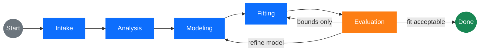

<p align="center">
  
</p>

[](https://doi.org/10.5281/zenodo.18940694)

<h1 align="center">Automated Reflectivity Evaluator</h1>

AuRE is an intelligent agent for analyzing neutron and X-ray reflectivity data.
It uses an LLM-driven workflow to go from a raw data file and a plain-English
sample description to a fitted
[Refl1D](https://refl1d.readthedocs.io) model — automatically.

## What's new

- **Thin-layer robustness** — thin layers sit on a contrast×thickness
  degeneracy ridge where a single optimizer run can silently pick the wrong
  basin (and BIC then rejects a real layer). AuRE now ships: an always-on
  `thin-layer-degeneracy` skill teaching the lesson; an opt-in
  `MODE_ENUMERATION` fitting step that enumerates discrete SLD seeds to find
  the right basin; a deterministic **SLD-profile artifact detector** that
  flags physically impossible roughness excursions a good χ² hides; and an
  optional `roughness_tie` (σ = fraction × thickness) that keeps a thin layer's
  interface from outgrowing it. See [docs/approach.md](docs/approach.md) §6.8.
- **Adaptive, skill-driven hypothesis loop** — your stated hypothesis
  (`-h "there may be an oxide on top"`) is turned into top-ranked candidate
  structural changes at intake, and when a fit reveals an unexpected artifact
  (residual fringes, a parameter pinned at a bound, χ² stalling) the
  evaluation step re-selects domain skills from that evidence, proposes new
  hypotheses, and re-ranks the list — so the agent can bring in prior
  knowledge the sample description alone never surfaced. The candidate list
  is also membership-guarded: the refinement step may only update hypothesis
  statuses, never silently add or rename them. See
  [docs/approach.md](docs/approach.md) §6.
- **Multi-state co-refinement** — when one sample is measured under
  several physical conditions (solvent contrast, anneal step, swelling
  series, applied potential, ...), declare a `states:` block in your
  config and AuRE will tie the structural parameters across states
  while keeping per-state ambient SLD and intensity independent. See
  [Multi-state co-refinement](#multi-state-co-refinement) below and the
  bundled `multi-state-corefinement` skill for a reproducible end-to-end
  example and configuration guidance.

## How it works

AuRE runs an iterative analysis pipeline:



1. **Intake** — Loads the reflectivity data file and parses the sample
   description with an LLM to extract structured layer/substrate/ambient
   information (materials, thicknesses, SLDs via `periodictable`). A second
   LLM call, guided by the `structural-hypothesis-ranking` skill, produces
   a **ranked list of candidate structural changes** (e.g. "add native CuO
   on top of Cu") that the refinement loop will consider if the initial
   model does not fit well. Your `-h` hypothesis is folded into this list as
   top-ranked entries, and tentative "maybe" layers stay out of the baseline
   model — they are tested as hypotheses instead.
2. **Analysis** — Extracts physics features from the data: critical edge,
   total thickness from Kiessig fringes, estimated roughness, and layer count.
3. **Modeling** — The LLM generates or refines a Refl1D model, informed by
   the parsed sample, the extracted features, the active
   [Agent Skills](src/aure/skills/), and the hypothesis list.
4. **Fitting** — Runs the generated model through Refl1D's optimizer.
   Optionally (`MODE_ENUMERATION=1`), a **thin-layer SLD mode enumeration**
   step first re-seeds each thin layer's SLD across discrete levels and starts
   the fit from the best basin — escaping the contrast×thickness-ridge local
   minima that make a single optimizer run silently drop a real thin layer.
5. **Evaluation** — Assesses the fit quality (χ², BIC, residual structure,
   parameter reasonableness) and decides whether to stop, re-fit with
   widened bounds only (a shortcut that saves one LLM call), or loop back
   to modeling for a real refinement. Automatic χ² and BIC *regression
   guardrails* revert the model if a refinement made things worse and mark
   the tried hypothesis as rejected. A deterministic **SLD-profile artifact
   check** flags physically impossible roughness excursions (a profile dipping
   below/above what its bounding media can produce) that a good χ² would
   otherwise hide. When the fit stalls or the residuals reveal an unmodeled
   layer, it also **re-selects skills from the observed evidence and
   proposes/re-ranks new hypotheses** — the only place besides intake that
   grows the candidate list.
6. **Refinement** — When the evaluator decides a refinement is needed, it
   tells the modeling node whether to do a parameter tweak or to realize
   a specific structural hypothesis from the ranked list. The loop
   repeats up to a configurable number of iterations.

Checkpoints are saved after every stage so you can inspect intermediate results
or resume a run from any point.

> For a complete, narrative introduction to the design — including a primer
> on reflectometry and LLMs, the role of Agent Skills, the ranked-hypothesis
> refinement loop, and the division of labour between the LLM and
> deterministic code — see [docs/approach.md](docs/approach.md). Diagrams of
> how each LLM prompt is assembled, per node, live alongside it:
> [intake](docs/intake-llm.svg), [modeling](docs/modeling-llm.svg), and
> [evaluation](docs/evaluation-llm.svg).

## Installation

Requires **Python ≥ 3.9** (3.12 is what CI uses). All runtime dependencies ship
as pre-built wheels, so no compiler is needed on any platform.

### macOS / Linux

```bash
# Clone the repository
git clone https://github.com/neutrons-ai/aure.git
cd aure

# Create a virtual environment and install
python -m venv .venv
source .venv/bin/activate
pip install -e "."
```

### Windows

Use the Python launcher (`py`) and the platform-appropriate activation script.

```bat
git clone https://github.com/neutrons-ai/aure.git
cd aure

py -m venv .venv
.\.venv\Scripts\activate.bat
pip install -e "."
```

### Extras

| Extra     | What it adds                                      |
|-----------|---------------------------------------------------|
| `export`  | `nr-isaac-format` — ISAAC AI-Ready Data export    |
| `alcf`    | `globus-sdk` — native Globus auth for ALCF inference endpoints |
| `dev`     | pytest                                            |
| `all`     | All of the above                                  |

### LLM configuration

AuRE reads its LLM settings from environment variables (or a `.env` file in the
project root).  See [.env.example](.env.example) for every available option.

```bash
LLM_PROVIDER=openai          # "openai", "gemini", "alcf", or "local"
LLM_MODEL=gpt-4o             # model name for your provider
LLM_API_KEY=sk-...           # API key
# LLM_BASE_URL=              # only needed for local / openai-compatible
```

#### ALCF inference endpoints

To use the [ALCF inference service](https://docs.alcf.anl.gov/services/inference-endpoints/)
at Argonne National Laboratory:

```bash
LLM_PROVIDER=alcf
ALCF_CLUSTER=sophia           # "sophia" (vLLM) or "metis" (SambaNova)
LLM_MODEL=gpt-oss-120b        # any model served on the cluster
# ALCF_ACCESS_TOKEN=...       # Globus token (optional – see below)
```

If `ALCF_ACCESS_TOKEN` is not set AuRE will try, in order:

1. **`globus_sdk`** (install with `pip install aure[alcf]`) — reuses cached
   Globus tokens; no subprocess needed.
2. **`inference_auth_token.py get_access_token`** — subprocess fallback.

See the [ALCF docs](https://docs.alcf.anl.gov/services/inference-endpoints/#2-authenticate)
for initial Globus authentication setup.

## Co-refinement (multi-file fitting)

When you have multiple reflectivity datasets — either Q-range segments of one
physical sample, or several physical states of the same sample (solvent
contrast, anneal step, swelling series, …) — AuRE fits them simultaneously.

All data files live inside a `states:` block in your setup YAML. Even a
single-file run uses one state.

### CLI (ad-hoc shortcut)

For a quick one-off without a setup file, the positional `DATA_FILE` plus
`-d / --extra-data` builds a synthetic one-state run for you:

```bash
aure analyze low-Q.dat "Cu/Ti on Si" -d mid-Q.dat -d high-Q.dat -o ./output -v
```

### Setup YAML (preferred)

For anything multi-state or repeatable, drop the configuration in a setup
file and pass it via `-c`:

```yaml
sample_description: |
  2 nm CuOx / 50 nm Cu / 3 nm Ti on Si.

states:
  - name: D2O
    extra_description: ambient is D2O (SLD ~6.4)
    data_files:
      - file: Rawdata/REFL_226642_combined_data_auto.txt
  - name: H2O
    extra_description: ambient is H2O (SLD ~-0.56)
    data_files:
      - file: Rawdata/REFL_226660_combined_data_auto.txt

# Optional whitelist (mutually exclusive with `unshared_parameters`)
shared_parameters:
  - Cu.thickness
  - Cu.material.rho
  - Cu.interface
```

```bash
aure analyze -c setup.yaml -o ./output -v
```

Single-Q-segment co-refinement: declare one state with multiple files.
Multi-state: declare multiple states. The default tied set
(when neither `shared_parameters` nor `unshared_parameters` is supplied) ties
thickness, SLD, and interface for every layer plus the substrate interface.

#### Locating data files

Relative `data_files` paths are resolved against the first directory that
contains the file, searched in this order:

1. an **explicit override** — the `--data-dir` CLI flag, or a top-level
   `data_dir:` key in the setup YAML (the flag wins over the key);
2. the directory holding the setup / manifest file;
3. the current working directory.

This lets a setup file reference data by bare filename while the actual
files live somewhere else — for example analyzer's `plan-data` output kept
in a `plan/` subfolder while the data sits one level up:

```yaml
# plan/job.yaml
data_dir: ../Rawdata          # resolved relative to plan/
states:
  - name: state0
    data_files:
      - file: REFL_226642_combined_data_auto.txt
```

Or override it on the command line (highest priority; for `aure batch` it
applies to every job, overriding any per-job or `defaults:` `data_dir:`):

```bash
aure analyze -c plan/job.yaml --data-dir ./Rawdata -o ./output
aure batch manifest.yaml --data-dir ./Rawdata
```

Absolute paths are used as-is. A file found in none of the candidate
directories raises an error that lists the directories searched. `data_dir:`
is a load-time resolution hint only — saved setups always carry the
fully-resolved absolute paths, so it is never written back out.

### Manifest (batch)

A batch manifest is a list of setups under `jobs:` plus an optional
`defaults:` block. A flat setup file (no `jobs:` wrapper) is accepted as a
1-job manifest:

```yaml
defaults:
  output_root: ./output
  max_refinements: 5

jobs:
  - name: copper_corefinement
    sample_description: 50 nm copper on 5 nm Ti on silicon
    states:
      - name: state0
        data_files:
          - file: data/REFL_218386.txt
          - file: data/REFL_218387.txt
          - file: data/REFL_218388.txt
```

### Web UI

In the Setup tab:
- **Load Setup** uploads a YAML and prefills every field (sample
  description, states, ties, refinement settings).
- **Save Setup** downloads the current form state as a YAML you can
  rerun via `aure analyze -c` / `aure batch` or share with collaborators.
- Click **Load Data** to add files manually, tick the fit checkbox on
  each one, then toggle *Group files into states* for multi-state mode.

Per-state outputs are written under
`output/refl1d_output/fit_iter{i}_{method}/state_<name>/profile.dat`. See the
`multi-state-corefinement` skill for guidance on choosing the tie set for
common experiments.

#### Web UI affordances

The setup tab includes everything you need for multi-state work without
hand-editing YAML:

- **Group files into states** toggle adds a state-name column next to each
  fit file. Same-state files plot in matching colours.
- **Cross-state ties panel** picks between Auto (skill defaults), Shared
  (whitelist) and Unshared (blacklist) modes. Quick-fill presets cover
  Structural / Substrate / All-but-ambient layouts; the free-form textarea
  accepts one dotted-name per line.
- **Preview structure** runs intake → analysis → modeling without fitting
  and renders a two-column checklist of layers and tieable parameters that
  tick straight into the textarea.
- **Per-state overrides accordion** lets you adjust ambient SLD,
  intensity / background / theta_offset / sample_broadening triplets,
  back-reflection, and per-state extra descriptions without leaving the
  page. `background` fits one flat background tied across the state's data
  files; `theta_offset` / `sample_broadening` are partials-only.
- **Load Setup / Save Setup** round-trip the entire form to a setup YAML
  that also works with `aure analyze -c` and `aure batch` — handy for
  saving experimental configurations or sharing with collaborators.

### Python API

```python
from aure import run_analysis

result = run_analysis(
    data_file="data/REFL_218386.txt",
    sample_description="Cu/Ti on Si in dTHF",
    states=[
        {
            "name": "state0",
            "data_files": [
                {"file": "data/REFL_218386.txt", "label": "REFL_218386"},
                {"file": "data/REFL_218387.txt", "label": "REFL_218387"},
                {"file": "data/REFL_218388.txt", "label": "REFL_218388"},
            ],
        }
    ],
    output_dir="./output",
)
```

The output directory is named after the lowest run number in the set.

## CLI reference

After installation the `aure` command is available:

```
aure [OPTIONS] COMMAND [ARGS]...
```

### `aure check-llm`

Check LLM configuration and connectivity.

```bash
aure check-llm [--json] [--no-test] [--fix]
```

| Option | Description |
|--------|-------------|
| `--json` | Output as JSON |
| `--no-test` | Skip the live connection test |
| `--fix` | Attempt to fix issues (e.g. download ALCF auth script) |

### `aure analyze`

Run a full analysis workflow on a reflectivity data file.

```bash
aure analyze [DATA_FILE] [SAMPLE_DESCRIPTION] [OPTIONS]
```

`DATA_FILE` and `SAMPLE_DESCRIPTION` are optional when `-c setup.yaml`
supplies them (the YAML's `states:` block carries the data files, its
`sample_description:` field carries the description). When both positional
arguments and the setup file specify the same field, positionals win.

| Option | Description |
|--------|-------------|
| `-o, --output-dir PATH` | Save checkpoints and model scripts to this directory |
| `-m, --max-refinements N` | Maximum refinement iterations (default: 5) |
| `-h, --hypothesis TEXT` | Optional hypothesis to test — seeded as top-ranked candidate structural changes at intake |
| `-d, --extra-data PATH` | Extra data file (single-state co-refinement; ad-hoc only) |
| `-c, --config PATH` | Setup YAML file (states, evaluation criteria, model constraints, …) |
| `--data-dir PATH` | Directory to resolve relative `data_files` against (highest priority; requires `-c`). Search order: this dir → config file's dir → cwd |
| `-v, --verbose` | Stream workflow progress to stderr |
| `--json` | Emit results as JSON |

**Examples:**

```bash
# Ad-hoc single-file analysis
aure analyze data.txt "100 nm polystyrene on silicon"

# Save outputs, increase refinement budget
aure analyze data.txt "Cu/Ti bilayer on Si in dTHF" -o ./output -m 8 -v

# Ad-hoc multi-file co-refinement (single state synthesised internally)
aure analyze low-Q.dat "multilayer" -d mid-Q.dat -d high-Q.dat -o ./output

# Multi-state co-refinement via a setup file
aure analyze -c setup.yaml -o ./output
```

### `aure prepare`

Run intake → analysis → modeling **only** and emit a refl1d-ready
`problem.json` — no fitting. Use it to hand a model off to a standalone
refl1d run or a remote fit service. This is the standalone equivalent of the
`prepare` *command* in a batch manifest (see [`aure batch`](#aure-batch)).

```bash
aure prepare [DATA_FILE] [SAMPLE_DESCRIPTION] [OPTIONS]
```

As with `analyze`, `DATA_FILE` / `SAMPLE_DESCRIPTION` are optional when
`-c setup.yaml` supplies them.

| Option | Description |
|--------|-------------|
| `-o, --output-dir PATH` | Output directory for checkpoints, models, and `problem.json` (default: `./output/<model-name>`) |
| `-n, --model-name TEXT` | Base name for artifacts and the generated `problem.json` (default: derived from the data file stem) |
| `-h, --hypothesis TEXT` | Optional hypothesis to test |
| `-d, --extra-data PATH` | Additional data file (single-state co-refinement; ad-hoc only) |
| `-c, --config PATH` | Setup YAML file (states, model constraints, …) |
| `--data-dir PATH` | Directory to resolve relative `data_files` against (highest priority; requires `-c`). Search order: this dir → config file's dir → cwd |
| `-v, --verbose` | Verbose logging |
| `--json` | Emit results as JSON |

**Examples:**

```bash
aure prepare data.dat "100 nm polystyrene on silicon"
aure prepare data.dat "multilayer" -o ./out -n my_model
aure prepare low-Q.dat "multilayer" -d mid-Q.dat -d high-Q.dat
aure prepare -c setup.yaml -n my_model
```

This writes `<output-dir>/<model-name>.json` (the bumps-serialised problem)
and a `<model-name>_definition.json` sidecar (the raw `ModelDefinition`). The
problem file loads directly into refl1d:

```bash
aure prepare data.dat "100 nm polystyrene on silicon" -n my_model
refl1d output/my_model/my_model.json
```

### `aure batch`

Run one or more jobs from a YAML manifest file.
Ideal for automated / CI workflows where the full configuration lives in
version control.

```bash
aure batch MANIFEST [OPTIONS]
```

| Option | Description |
|--------|-------------|
| `-j, --job NAME` | Run only the named job(s). Repeatable. Default: all |
| `--data-dir PATH` | Resolve relative `data_files` against this dir for **every** job (overrides per-job / `defaults:` `data_dir:`). Search order: this dir → manifest's dir → cwd |
| `--dry-run` | Validate the manifest and print the plan without running |

The manifest is a YAML file with an optional `defaults` section and a
`jobs` list. A flat single-setup file (no `jobs:` wrapper) is also accepted
— `aure batch` treats it as a one-job manifest. See
[manifest.example.yaml](manifest.example.yaml) and
[aure_config.example.yaml](aure_config.example.yaml) for the full schemas.

Each job supports a `command` field — either `analyze` (default, full
fit-and-refine workflow) or `prepare` (intake → analysis → modeling only,
emits `problem.json`).

**Examples:**

```bash
# Run every job in the manifest
aure batch manifest.yaml

# Run a single job
aure batch manifest.yaml -j copper_on_silicon

# Preview without executing
aure batch manifest.yaml --dry-run

# Flat single-job manifest — same file usable with `aure analyze -c`
aure batch setup.yaml
```

**Minimal prepare-mode manifest:**

```yaml
defaults:
  output_root: ./output

jobs:
  # Full workflow (fit + refine)
  - name: copper_analysis
    command: analyze
    sample_description: 50 nm copper on silicon
    max_refinements: 5
    states:
      - name: state0
        data_files:
          - file: data/copper.txt

  # Prepare only — stops before fitting, writes <output_root>/<name>/<model_name>.json
  - name: copper_prepare
    command: prepare
    sample_description: 50 nm copper on silicon
    model_name: copper_model        # optional; defaults to the job name
    states:
      - name: state0
        data_files:
          - file: data/copper.txt

  # Multi-file prepare with co-refinement (shared structure, per-file normalisation)
  - name: copper_corefinement_prepare
    command: prepare
    sample_description: 50 nm copper on silicon
    states:
      - name: state0
        data_files:
          - file: data/low-Q.txt
          - file: data/mid-Q.txt
          - file: data/high-Q.txt
```

The resulting `problem.json` can be passed directly to refl1d:

```bash
refl1d output/copper_prepare/copper_model.json
```

### `aure resume`

Resume a workflow from a previously saved checkpoint.

```bash
aure resume CHECKPOINT_PATH [OPTIONS]
```

| Option | Description |
|--------|-------------|
| `-o, --output-dir PATH` | Write new checkpoints here (defaults to the original) |
| `--fit / --no-fit` | Include or skip the fitting step |
| `-v, --verbose` | Verbose logging |
| `--json` | JSON output |

### `aure checkpoints`

List the checkpoints in an output directory.

```bash
aure checkpoints OUTPUT_DIR [--json]
```

### `aure inspect-checkpoint`

Show details about a single checkpoint file.

```bash
aure inspect-checkpoint CHECKPOINT_PATH [-s] [--json]
```

`-s, --show-state` prints the full workflow state (can be large).

### `aure evaluate`

Evaluate a refl1d fit result using LLM analysis, without re-running the
full workflow. Point it at a refl1d output directory containing a
`problem.json` and optionally describe the sample so the LLM can judge
physical plausibility.

```bash
aure evaluate REFL1D_DIR [OPTIONS]
```

| Option | Description |
|--------|-------------|
| `-c, --context TEXT` | Sample / model description to give the LLM context |
| `-h, --hypothesis TEXT` | Optional hypothesis being tested |
| `-v, --verbose` | Verbose logging |
| `--json` | JSON output |

If `REFL1D_DIR` is the parent `refl1d_output/` directory, the latest
`fit_iter*` subdirectory is selected automatically.

**Examples:**

```bash
# Evaluate a specific fit iteration
aure evaluate output/refl1d_output/fit_iter0_dream

# Provide sample context for better physical assessment
aure evaluate output/refl1d_output/fit_iter1_dream \
    -c "100 nm copper on 5 nm titanium on silicon, measured in D2O"

# Machine-readable output
aure evaluate output/refl1d_output/ --json
```

### `aure import-refl1d`

Ingest a hand-run refl1d `problem.json` into an AuRE output directory so it
can be opened with `aure serve`, judged with `aure evaluate`, or extended
with `aure resume`. `REFL1D_DIR` may be a specific `fit_iter*_*` directory or
its parent (the latest iteration is then picked automatically).

```bash
aure import-refl1d REFL1D_DIR [OPTIONS]
```

| Option | Description |
|--------|-------------|
| `-o, --output-dir PATH` | Target AuRE output directory (default: a sibling named `<REFL1D_DIR>_aure_import`) |
| `-c, --context TEXT` | Sample description recorded on the imported run |
| `-h, --hypothesis TEXT` | Optional hypothesis to attach to the imported run |
| `--state-name TEXT` | Override a recovered state name (repeatable, one per distinct sample; not combinable with `--setup`) |
| `--setup PATH` | Setup YAML describing the original problem (e.g. analyzer `plan-data` output) — the authoritative source for sample description, state names, and original data paths |
| `--data-dir PATH` | Directory holding the data files referenced by name in `--setup`, when the YAML lists bare filenames but the data lives elsewhere |
| `--back-reflection / --no-back-reflection` | Force stack orientation (default: auto-detect from material names) |
| `--force` | Overwrite `OUTPUT_DIR` if it exists |
| `-v, --verbose` | Verbose logging |
| `--json` | Machine-readable summary |

**Examples:**

```bash
# Auto-detect everything from the deserialised problem
aure import-refl1d ./refl1d_output/fit_iter0_dream -o ./imported

# Add sample context for downstream evaluation
aure import-refl1d ./refl1d_output -o ./imported -c "Cu/Ti on Si in D2O"

# Name the recovered states of a multi-state fit
aure import-refl1d ./fit_iter0_dream -o ./imported --state-name D2O --state-name H2O

# Use the original setup YAML as the source of truth
aure import-refl1d ./Cu-D2O-226642 --setup ./plan/job_Cu-D2O-226642.yaml
```

### `aure plot-results`

Plot R(Q) curves and SLD profiles from a completed run.

```bash
aure plot-results OUTPUT_DIR [OPTIONS]
```

| Option | Description |
|--------|-------------|
| `-s, --save PATH` | Save the figure (PNG, PDF, SVG) |
| `-f, --offset N` | Vertical offset between curves (default: 10) |
| `--no-show` | Don't open the interactive plot window |

### `aure extract-features`

Quickly extract physics features from a data file without running a full
analysis.

```bash
aure extract-features DATA_FILE [--json]
```

### `aure lookup-sld`

Look up neutron scattering length densities for one or more materials.

```bash
aure lookup-sld MATERIAL [MATERIAL ...] [-w WAVELENGTH] [--json]
```

```bash
aure lookup-sld silicon gold D2O
aure lookup-sld SiO2 polystyrene PMMA
```

### `aure list-materials`

List known materials in the built-in database.

```bash
aure list-materials [-c CATEGORY]
```

Categories: `polymers`, `metals`, `substrates`, `solvents`, `all` (default).

### `aure mcp-server`

Start a [Model Context Protocol](https://modelcontextprotocol.io/) server so AI
assistants (e.g. Claude) can drive the workflow interactively.

```bash
aure mcp-server                          # stdio (for Claude Desktop)
aure mcp-server --transport sse --port 8080  # HTTP/SSE
```

### `aure serve`

Launch the AuRE web interface.

```bash
aure serve [OUTPUT_DIR] [OPTIONS]
```

| Option | Description |
|--------|-------------|
| `-p, --port N` | Port for the local server (default: 5000) |
| `--host HOST` | Interface to bind to (default: `127.0.0.1`; use `0.0.0.0` inside Docker) |
| `--no-browser` | Don't open a browser automatically |

When `OUTPUT_DIR` is given the app opens in **viewer mode** showing results
from a completed run.  When omitted it starts in **interactive setup mode**
where you can load data files, describe the sample, and launch an analysis
from the browser.

The web UI has three tabs:

- **Setup** — load data files, enter sample description, and start a new
  analysis.  When viewing results from a previous run the form is
  pre-populated so you can rerun with the same or modified inputs.
- **History** — step-by-step checkpoint timeline and an interactive χ²
  progression chart (Plotly.js, zoomable).
- **Results** — log-log R(Q) plot with experimental data and model curves
  (zoomable/pannable), SLD depth profile, interactive parameter editing, and
  ISAAC AI-Ready Data export.

#### Interactive parameter editor

The Results tab includes an interactive parameter table where you can:

- **Slide** parameter values with range sliders bounded by the fit limits
- **Type** exact values into number inputs
- **Edit bounds** (Lo / Hi) to widen or narrow allowed ranges
- **See live updates** — reflectivity and SLD curves are recalculated in
  real time (debounced, via the Refl1D engine) and overlaid as a dashed
  "User" trace on the plots, with a live χ² readout
- **Reset** all parameters to their fitted values with one click
- **Restart analysis** — modified parameters and bounds are carried into a
  new fitting run when you click *Restart Analysis*

#### ISAAC export

Click **Export → ISAAC AI-Ready Format** to produce a validated
[ISAAC](https://github.com/isaac-neutrons/nr-isaac-format) record.  A text
box lets you add free-text context about the measurement; this context is
persisted in the browser across sessions and prepended to the LLM-generated
context description in the exported manifest.

```bash
aure serve               # interactive mode
aure serve ./output      # viewer mode
aure serve ./output --port 8080 --no-browser
```

### `aure interactive`

Alias for `aure serve` in interactive setup mode (no output directory).

```bash
aure interactive [DATA_FILE] [--port N] [--host HOST]
```

## Python API

```python
from aure import run_analysis

result = run_analysis(
    data_file="data.txt",
    sample_description="100 nm polystyrene on silicon",
    hypothesis="Single layer",
    max_iterations=5,
    output_dir="./results",
)
```

## Docker

Pre-built images are published to the GitHub Container Registry on every push
to `main` and on version tags (`ghcr.io/neutrons-ai/aure`).

### Pull the image

```bash
docker pull ghcr.io/neutrons-ai/aure:latest
```

### Build locally

```bash
docker build -t aure .
```

### Run

The working directory inside the container is `/work`. Mount your local data
and output directories there. Supply environment variables via an `--env-file`
(recommended) or individual `-e` flags.

**Run an analysis**

```bash
docker run --rm \
  --env-file .env \
  -v /path/to/data:/work \
  ghcr.io/neutrons-ai/aure:latest \
  analyze data.txt "100 nm polystyrene on silicon" -o /work/output -v
```

**Launch the web viewer**

```bash
docker run --rm \
  --env-file .env \
  -v /path/to/output:/work/output \
  -p 5000:5000 \
  ghcr.io/neutrons-ai/aure:latest \
  serve /work/output --host 0.0.0.0 --no-browser
```

Then open <http://localhost:5000> in your browser.

> Warning: The `serve` command starts an unauthenticated web UI, and the Docker example above publishes it on all network interfaces (`--host 0.0.0.0` with `-p 5000:5000`). This setup is intended for local development on trusted networks only. Do not expose this UI directly to the internet or other untrusted networks; instead, bind Docker to localhost (for example, `-p 127.0.0.1:5000:5000`), restrict access with firewall rules, or place it behind an authenticated reverse proxy.
**Minimal `.env` file**

```bash
LLM_PROVIDER=openai
LLM_MODEL=gpt-4o
LLM_API_KEY=sk-...
```

See [.env.example](.env.example) for all available options.
