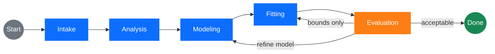

# How AuRE Works — A Guide for New Users

This document explains what AuRE does and *why it does it the way it does*,
from the ground up. It assumes no prior knowledge of reflectometry and no
prior experience with large language models (LLMs). It is longer than a
typical README section on purpose: it is meant to be the piece of writing you
read once to understand the whole system, the kind of write-up you would
expect to find in the appendix of a methods paper.

If you already know reflectometry and LLMs and just want to understand the
changes that were introduced in the "skill-driven hypothesis" version of the
refinement loop, skip to §6 ("The refinement problem and how AuRE solves
it").

---

## 1. The scientific problem

**Neutron reflectometry** is a technique for measuring the thickness, density,
and roughness of thin films — typically films that are a few nanometres to a
few hundred nanometres thick, deposited on a flat substrate such as a silicon
wafer. It works by firing a beam of neutrons at the sample at a very shallow
angle and measuring what fraction of the beam bounces back (is *reflected*)
at each angle or wavelength.

The raw measurement is a curve: reflectivity $R$ as a function of the
momentum transfer $Q$ (in units of inverse Ångström, Å⁻¹). $Q$ encodes how
steeply the neutrons are probing: small $Q$ probes length scales of hundreds
of Ångström, large $Q$ probes single-Ångström features. A typical curve
starts near $R \approx 1$ at very small $Q$ (*total external reflection*),
drops sharply at a *critical edge*, and then decays over many orders of
magnitude, often showing oscillations called *Kiessig fringes* whose spacing
encodes the total film thickness:

$$R(Q) \approx \text{(some function of how the scattering-length density varies with depth)}$$

The key inversion problem is:

> Given a 1D reflectivity curve $R(Q)$, reconstruct the depth profile of
> scattering-length density (SLD), $\rho(z)$, along the sample normal.

This inversion is **not unique**. Many SLD profiles fit the same curve
equally well. So in practice one does not freely invert the data — one
builds a *physical model* of the sample (a stack of homogeneous layers, each
with thickness, SLD, and roughness) and fits its parameters. Choosing *which
layers to put in the model* is where the human expertise lives. A model with
too few layers will fit poorly; a model with too many layers will fit well
but be statistically unjustified and have parameters that cannot be
distinguished from each other.

**In short**, reflectometry fitting is two intertwined problems:

1. A **structural** problem — which layers does the sample have? which are
   missing from the model? which extra ones are redundant?
2. A **parameter** problem — given a layer structure, what are the
   thicknesses, SLDs, and roughnesses? Are they all within physically
   reasonable bounds?

Standard fitting software ([Refl1D](https://refl1d.readthedocs.io),
[MOTOFIT](http://motofit.sourceforge.net), BornAgain, …) is very good at
solving the parameter problem once you have picked a structure. It does not
solve the structural problem for you.

---

## 2. What AuRE is

AuRE is an *agent* that solves both problems together for a given dataset.
It takes two inputs from the scientist:

- the reflectivity data file, and
- a plain-English description of the sample (e.g. *"100 nm polystyrene on
  silicon in air"*, or *"50 nm copper on 5 nm Ti on Si in D2O"*),

and it produces a fitted Refl1D model. Internally, it runs a loop that
alternates between **deciding what the model should look like** (a task
historically done by the scientist) and **running the optimizer to fit its
parameters** (a task done by Refl1D). Between iterations it evaluates the
fit and decides whether to stop or to modify the model.

The LLM does the "thinking" parts — parsing the sample description,
proposing model structures, judging the fit, deciding what to change next.
The non-LLM parts — reading data files, computing chi-squared, running the
Markov-chain optimizer — are ordinary Python code.

This is sometimes called an *agentic* workflow. What makes it an agent,
rather than just a one-shot LLM prompt, is that the LLM sees the *results
of its previous actions* (fit quality, residuals, parameter values at
bounds) and chooses its next action in response. AuRE runs this loop under
the [LangGraph](https://github.com/langchain-ai/langgraph) framework,
which provides the machinery for passing state between steps and
check-pointing progress.

---

## 3. A one-minute LLM primer

An **LLM** (large language model) is a program that, given some text, can
produce more text that looks like a plausible continuation. Modern LLMs —
GPT-4, Claude, Gemini, Llama, and so on — have been trained on enormous
amounts of scientific text and can, when asked, explain concepts, follow
instructions, generate structured data (like JSON), and reason about simple
numerical and physical problems.

For this project, you need to remember four things:

1. **An LLM is just a function from text to text.** We send it a prompt, we
   get back a response. We re-invoke it for each step of the workflow.
2. **LLMs can be asked for structured output.** We tell the model "respond
   with a JSON object matching this schema" and parse the result. Much of
   AuRE's machinery is about phrasing questions in a way that produces a
   *reliable* structured answer.
3. **LLMs do not remember anything between calls.** Every call is
   independent. If we want the model to "know" what happened in the
   previous iteration, we must explicitly include it in the new prompt.
4. **LLMs are easy to mislead with phrasing.** If a prompt says "try
   parameter tweaks first, structural changes as a last resort", the model
   will dutifully try parameter tweaks for a long time before giving up —
   even when the right answer is structural. (This is one of the key
   lessons in §6.)

AuRE treats the LLM as *one expert reviewer on a panel*. The expert is
opinionated and knowledgeable but not infallible. The rest of the system —
guardrails, state tracking, checkpoints — exists to keep the expert honest.

---

## 4. The AuRE workflow

AuRE's core is a state machine with five nodes. The state is a Python
dictionary ([`ReflectivityState`](../src/aure/state.py)) that accumulates as
the workflow proceeds.



### 4.1 Intake

The **intake** node does three jobs:

1. **Load the data file** from disk and validate it (finite $Q$ and $R$,
   positive errors, sensible ranges).
2. **Parse the sample description** with an LLM call. The response is a
   structured JSON object: substrate, list of layers (each with a starting
   thickness, SLD, roughness, and initial bounds), ambient medium, and any
   constraints the user mentioned (e.g. *"the Cu layer is pinhole-free"*).
   SLDs are looked up from the `periodictable` library when the material is
   a simple formula; otherwise the LLM supplies a literature value and
   plausible bounds.
3. **Generate a ranked list of structural hypotheses** (see §6). This is a
   second LLM call, guided by an always-on skill called
   [`structural-hypothesis-ranking`](../src/aure/skills/structural-hypothesis-ranking/SKILL.md).
   The output is a list of candidate structural changes that the refinement
   loop should consider if the initial model does not fit well — for
   example, *"add a 10–30 Å native CuO between the Cu and the D₂O"*.

The result of intake is stored as `parsed_sample`, the initial
`current_model`, and `structural_hypotheses` in the workflow state.

### 4.2 Analysis

The **analysis** node runs ordinary Python (no LLM) over the data to
extract physics features:

- the **critical edge** $Q_c$, from which the substrate SLD can be
  cross-checked;
- the **estimated total thickness**, from the Kiessig fringe spacing;
- the **estimated surface roughness**, from the high-$Q$ decay rate;
- an **estimated number of layers** based on how many distinct fringe
  frequencies are present in the Fourier spectrum of $R(Q)Q^4$.

These features are later included in LLM prompts so the model has
data-derived numbers to compare against its own guesses.

### 4.3 Modeling

The **modeling** node is the LLM's main creative step. On the first
iteration it simply confirms the intake-parsed model (possibly adjusting
starting values to match the analysis features). On subsequent iterations
it *refines* the model in response to the previous fit.

The modeling prompt contains:

- the current model as JSON,
- the best-fit parameters, χ², and convergence status from the last fit,
- the physics features from analysis,
- the residual-fringe analysis from evaluation (see §4.5),
- the **active skills' content** (see §5),
- the **structural hypotheses list** with statuses,
- the evaluator's explicit direction (`next_action` — either
  `parameter_tweak` or `structural_change` — and, if the latter, a
  `proposed_hypothesis_id` pointing into the hypothesis list).

The response is a complete JSON model definition. The node validates it,
preserves immutable fields (like the data-file path), and writes it back
into the state. If the LLM output is invalid JSON, the node falls back to
simply widening all the bounds and trying again — a safety net that
prevents a malformed response from derailing the run.

### 4.4 Fitting

The **fitting** node runs [Refl1D](https://refl1d.readthedocs.io)'s
optimizer (differential evolution followed by, optionally,
DREAM/MCMC) on the current model. It returns best-fit parameter values,
uncertainties, a final χ², the residuals, and whether the fit converged.
This is ordinary numerical optimization — no LLM involved.

### 4.5 Evaluation

The **evaluation** node is the decision-maker. It does four things:

1. **Auto-expand stuck bounds.** If any fitted parameter ended at its
   bound, the bound is widened by a factor (e.g. ×1.5 outward) and the
   issue is logged. This is a purely mechanical step that saves the LLM
   from having to ask for it.
2. **Residual-fringe analysis.** A small Fourier analysis of the
   residuals; if it shows a clear oscillation at a characteristic
   thickness, that thickness is reported to the LLM as a likely "missing
   layer" hint.
3. **Call the LLM for a judgement.** The LLM sees the fit result, the
   features, the residual analysis, the **χ² and BIC trajectory across
   all previous iterations**, and the **hypothesis list with statuses**.
   It responds with a JSON object containing `acceptable` (bool),
   `issues`, `suggestions`, `next_action`, and optionally a
   `proposed_hypothesis_id`.
4. **Apply guardrails.** Two statistical guardrails run
   *independently of the LLM's opinion*:
   - **χ² regression guardrail.** If the current χ² is significantly
     worse than the best χ² seen so far, the node reverts the
     `current_model` to the best one and injects an issue telling the
     next modeling step to try a different direction.
   - **BIC regression guardrail.** Adding a layer will almost always
     lower χ² because it gives the fit more freedom. What we actually
     want is a model that is *statistically justified*, measured by the
     Bayesian Information Criterion:
     $$\mathrm{BIC} = k \ln n + \chi^2$$
     where $k$ is the number of free parameters and $n$ is the number of
     data points. If the most recent iteration added parameters and the
     BIC went up despite χ² going down, the added complexity was not
     worth it. The node reverts to the best-BIC model and marks the
     hypothesis that was just tried as `rejected`.

The evaluator's LLM may *suggest* a revert, but the guardrails *enforce*
it deterministically. This is a deliberate division of labour: the LLM
reasons about the shape of the fit, and code enforces the statistical
invariants.

After evaluation, the router decides the next step. There are three
possible transitions:

- **`complete`** — the fit is acceptable, or the iteration budget is
  exhausted;
- **`fitting`** — the only issue was a bound hit and no LLM refinement is
  needed (this saves an iteration; see §6.4);
- **`modeling`** — the normal refinement path.

---

## 5. Agent Skills

An **Agent Skill** is a Markdown file with YAML frontmatter that encodes
domain expertise. Each skill lives in its own directory under
[`src/aure/skills/`](../src/aure/skills/). The frontmatter tells AuRE when
to activate the skill (by matching against the sample description); the
body is prose that is injected directly into the LLM's prompt whenever the
skill is active.

For example, the [`metal-oxide-interfaces`](../src/aure/skills/metal-oxide-interfaces/SKILL.md)
skill contains domain facts like *"copper exposed to air or water forms a
10–50 Å native CuO with SLD ≈ 5.0×10⁻⁶ Å⁻² and roughness 3–15 Å"*. When a
sample description mentions copper, this skill is activated and its text
is prepended to the modeling, evaluation, and refinement prompts.

The skills currently shipped:

| Skill | When it activates | What it knows |
|---|---|---|
| `neutron-reflectometry` | Always | Baseline SLD reference values, BIC guidance, Refl1D conventions |
| `structural-hypothesis-ranking` | Always | How to generate and consume a ranked hypothesis list (§6) |
| `metal-oxide-interfaces` | Samples with Cu, Ti, Fe, exposed metals | Native oxide thicknesses, SLDs, and when to add them |
| `polymer-films` | Samples with polymers, PS, PMMA, etc. | Polymer SLDs, typical roughness, glass-transition effects |
| `sei-layer-analysis` | Battery / electrolyte samples | Solid-electrolyte interphase layer conventions |
| `solvent-contrast-matching` | Samples in D₂O, H₂O, deuterated solvents | Solvent SLDs, contrast matching, isotope-confusion traps |

Skill activation is itself an LLM decision. At the start of a run, the
model is given the list of available skills and the user's sample
description, and asked which ones apply. Always-on skills are added
automatically regardless of the LLM's answer. When the selector LLM is
unavailable or returns an empty list, the always-on skills alone remain.

**Why skills and not just one giant prompt?** Three reasons:

1. **Focus.** A prompt with only the domain knowledge that applies to the
   current sample fits in a smaller context window and the LLM pays more
   attention to it.
2. **Testability.** Skills can be unit-tested, versioned, and revised
   independently of the code. Fixing a wrong SLD is a Markdown edit, not
   a code change.
3. **Explainability.** Every action the agent takes can be traced to the
   skill that justified it. If the agent adds a CuO layer, the rationale
   will cite `metal-oxide-interfaces`.

Guidance inside skills is written as *descriptive prose for the LLM* —
not as conditional rules that code evaluates. This matters a lot: see §6.

---

## 6. The refinement problem and how AuRE solves it

This is the part of the design that is most specific to AuRE. It deserves
its own section because it is where the "agentic" aspects really matter
and where naive approaches fail.

### 6.1 The failure we set out to fix

Early versions of AuRE had a frustrating failure mode. The agent would be
given a sample like *"50 nm copper on 5 nm Ti on Si, measured in D₂O"* and
initially build a model with exactly those three layers. The first fit
would land at χ² of, say, 12 (poor). The evaluator would notice the fit
was not great. The modeling node would respond by *tweaking parameters* —
widening the Cu thickness bounds, nudging the Ti roughness, enabling
`sample_broadening` on one segment — and the next iteration would see χ²
drop slightly but still be poor.

This would repeat for five or six iterations. Each time, the model would
change *slightly* and χ² would improve *slightly*. The agent would
eventually run out of its iteration budget without ever realizing that
the real problem was structural: there is a ~20 Å layer of CuO (copper
oxide) on top of the copper — which always forms spontaneously when
copper is exposed to water — that was not in the model.

The root cause was a design mistake, not an LLM mistake. The skill files
contained phrases like *"if χ² > 10, consider adding a surface oxide"*
and *"structural changes are a last resort"*. Those phrases were read by
the LLM and dutifully obeyed. The agent would spend its entire budget on
parameter tweaks because we had told it, in so many words, that structural
changes come last.

### 6.2 The constraint we put on the fix

When we set out to improve this, we committed to one explicit constraint:

> **The fix must not be a heuristic in code.** We will not write rules
> like "after N iterations of no improvement, force a structural change"
> or "if χ² has not dropped by X%, add a layer". All decision-making
> about whether to do a structural change must live in the LLM's prompts
> and in the skills.

The reason is maintainability. Heuristic thresholds are wrong for some
sample and right for others; every time we add one, we have to debug it
later. The LLM, properly prompted with the trajectory and the available
hypotheses, can make the call much better than any fixed threshold can.

The fix is therefore *prompt-engineering*, *state-shape*, and *skill
content*. Only two pieces of code were added: an optimisation for
bound-only iterations (§6.4) and some bookkeeping around hypothesis
status (§6.3).

### 6.3 Ranked structural hypotheses

The central new idea is the **ranked structural-hypothesis list**. At
intake time, after the sample description has been parsed, a second LLM
call — guided by the `structural-hypothesis-ranking` skill — enumerates
every structural change that might plausibly improve the fit. For the
copper example above, that list would contain an entry like:

```json
{
  "id": 1,
  "title": "Add native CuO on top of Cu",
  "rationale": "metal-oxide-interfaces: Cu exposed to D2O forms a 10–50 Å CuO with SLD ≈ 5.0",
  "change": "insert a 10–30 Å CuO layer (SLD 4.5–5.5) between Cu and D2O, σ 3–15 Å",
  "skill_source": "metal-oxide-interfaces",
  "status": "pending",
  "tried_in_iteration": null,
  "notes": ""
}
```

along with a handful of other candidates — each ranked by

1. **prior probability** (native oxides on exposed metals in aqueous
   ambients are nearly certain),
2. **expected effect size** (a 20 Å CuO between Cu and D₂O produces a
   big low-$Q$ contrast step),
3. **cost in parameters / BIC** (fewer added parameters is better), and
4. **reversibility** (easy-to-revert changes rank higher than stack
   re-orderings).

This list is stored in the workflow state as `structural_hypotheses` and
is passed into *every* subsequent modeling and evaluation prompt. Each
entry carries a `status` field with one of four values:

- `pending` — not yet tried.
- `tried` — realized in the model in some iteration; outcome unknown.
- `confirmed` — was realized and the fit improved materially.
- `rejected` — was realized and the BIC guardrail reverted it.

The statuses drive the agent's behaviour through prompts, not through
code. The evaluator's prompt says, in essence: *"here is the trajectory
of χ² and BIC across every iteration; here is the list of hypotheses and
their statuses; decide whether the next refinement should be a
parameter-tweak or a structural change, and if structural, cite the
hypothesis id."* The modeling prompt says: *"here is the hypothesis list;
if the evaluator picked one, realise it in the model and stamp its status
as `tried`; otherwise leave the list unchanged."*

This makes the loop *explicit and auditable*. After a run you can open
the final checkpoint and see exactly which hypotheses were considered,
which were tried, which were confirmed, and which were rejected — with
the reasoning visible in the LLM's own words.

### 6.4 The bounds-only shortcut

A frequent intermediate state is: the fit ran, one parameter hit its
bound, the evaluation node auto-expanded the bound, and there are no
other issues. In earlier versions this still triggered a full LLM
refinement call (modeling → fitting → evaluation) even though the only
thing that needed to change was already done by the evaluation node.

The fix is a one-field optimisation. The evaluator sets
`bounds_only_refinement = True` when the *only* issue is an auto-expanded
bound. The router honours this by routing directly from `evaluation` back
to `fitting`, skipping the `modeling` node entirely and saving one LLM
call per such iteration. This is the only non-cosmetic heuristic in the
whole refinement system, and it is justified because it is purely an
optimisation — the bound has *already* been expanded deterministically
before this check runs; the skipped modeling call would have been a
no-op.

### 6.5 Skill revisions

Alongside the code changes, two existing skills were rewritten to remove
prompt-level biases:

- In [`metal-oxide-interfaces`](../src/aure/skills/metal-oxide-interfaces/SKILL.md),
  the phrase *"consider adding a surface oxide if χ² > 10"* was replaced
  with guidance to *emit a high-ranked hypothesis at intake time*. This
  moves the decision from late in the loop (when iterations are already
  being wasted) to intake (where it costs nothing).
- In [`neutron-reflectometry`](../src/aure/skills/neutron-reflectometry/SKILL.md),
  the phrase *"structural changes are a last resort"* was replaced with a
  description of the hypothesis list as the canonical mechanism for
  structural changes. The BIC section now emphasises that there is an
  automatic guardrail and that the LLM does not need to be conservative
  about trying a hypothesis — if it was a bad idea, the guardrail will
  revert it and mark it `rejected`.

### 6.6 Division of labour between LLM and code

The table below summarises who decides what.

| Decision | Who makes it | How it is made |
|---|---|---|
| Parse the sample into a layer stack | LLM | `format_sample_parsing_prompt` |
| Generate ranked hypothesis list | LLM | `structural-hypothesis-ranking` skill |
| Choose which skills apply | LLM | Skill selector prompt |
| Propose refinement direction (tweak vs structural) | LLM | Evaluation prompt with trajectory + hypotheses |
| Realize a structural change | LLM | Modeling refinement prompt |
| Update hypothesis status after realising a change | LLM | Modeling refinement prompt |
| Auto-expand stuck bounds | Code | `_expand_model_bounds` in `evaluation.py` |
| Revert on χ² regression | Code | χ² regression guardrail |
| Revert on BIC regression + mark hypothesis `rejected` | Code | BIC regression guardrail |
| Route to fitting on bounds-only iterations | Code | `route_after_evaluation` |

The pattern is: the LLM *proposes* and *explains*; code *enforces
invariants*, *reverts regressions*, and *bookkeeps deterministic
outcomes*.

---

## 7. Reading the output of a run

When you run `aure analyze` with `-o ./output`, AuRE writes one
checkpoint file per completed node, as well as a final `state.json` with
the full workflow state. The files you will typically want to inspect are:

- **`intake_result.json`** — parsed sample and **the full ranked
  hypothesis list**. Inspecting this file after an unsuccessful run tells
  you whether the structural problem was even in the candidate list.
- **`analysis_result.json`** — the data-derived physics features.
- **`modeling_iter*.json`** — the model that was sent to the fitter at
  each iteration.
- **`fitting_iter*.json`** — the best-fit parameters and χ² per iteration.
- **`evaluation_iter*.json`** — the LLM's judgement, including
  `next_action` and `proposed_hypothesis_id`; plus the updated
  `structural_hypotheses` with statuses.

The web UI (`aure serve ./output`) reads these checkpoints and displays
the history interactively.

---

## 8. Extending AuRE with new skills

Adding a new piece of domain knowledge is usually a five-minute task:

1. Create a new directory under `src/aure/skills/<your-skill-name>/`.
2. Write a `SKILL.md` with YAML frontmatter (`name`, `description`, `metadata`)
   followed by a prose body.
3. The `description` is what the selector LLM sees when deciding whether to
   activate the skill; write it as if you were answering the question
   "when should this skill be active?".
4. Add `<your-skill-name>` to the always-on tuple in
   [`src/aure/skills/selector.py`](../src/aure/skills/selector.py) if it
   should run on every sample.
5. Add a test in [`tests/test_skills.py`](../tests/test_skills.py) if the
   skill should appear for specific sample descriptions.

Skills should speak to the LLM in the LLM's own language — prose, not
pseudocode. Imagine you are briefing a new colleague who has a physics
background but has not worked on this exact sample family before. Avoid
writing thresholds or conditional rules unless the threshold is a
physical constant (e.g. *"CuO SLD is 4.5–5.5"* is a physical fact,
*"if χ² > 10, do X"* is a workflow heuristic and belongs in the prompts
or in code, not in a skill).

---

## 9. Further reading

- **Reflectometry physics**:
  [Jens Als-Nielsen & Des McMorrow, *Elements of Modern X-ray Physics*](https://www.wiley.com/en-us/Elements+of+Modern+X+ray+Physics%2C+2nd+Edition-p-9781119970156),
  chapters on reflectivity.
- **Refl1D**: the [Refl1D documentation](https://refl1d.readthedocs.io)
  for the optimizer and model-description API AuRE builds on.
- **BIC**: Schwarz, G. (1978). "Estimating the Dimension of a Model".
  *The Annals of Statistics*. Explains why we prefer BIC over χ² for
  deciding whether to add a layer.
- **LangGraph**: the [LangGraph docs](https://langchain-ai.github.io/langgraph/)
  for the state-machine framework AuRE is built on.
- **Agent Skills pattern**: the
  [`src/aure/skills/`](../src/aure/skills/) directory is the canonical
  reference for how skills are structured.
